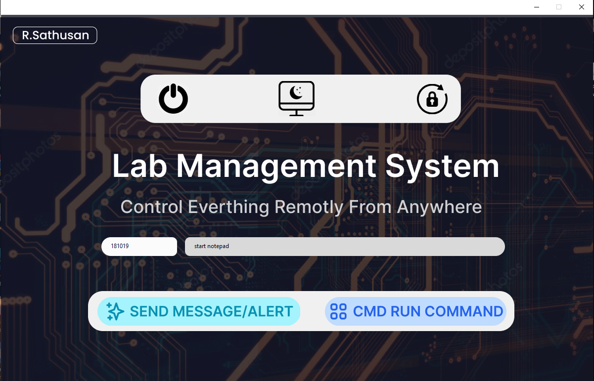

# Remotely-Lab-Management [ © R.Sathusan ]
- This desktop application allows the admin to remotely control computers in a laboratory from anywhere, even across different networks. With just a few clicks, the admin can perform various actions, including running all command comments, shutting down the computer, logging off, sending voice comments, and pop-up alerts. Additionally, this application provides several other features that the admin can use to perform other activities.

- The system is designed using **Python** and UI/UX website **Figma**

# Features
- Run CMD comments remotely
- Send popup alert with speech comment
- Shutdown / restart / Logout instantly with specific buttons
- Control specific or multiple computers with 6 degit codes
- Can be run from diffrent or same network (using 1sec.mail api)

